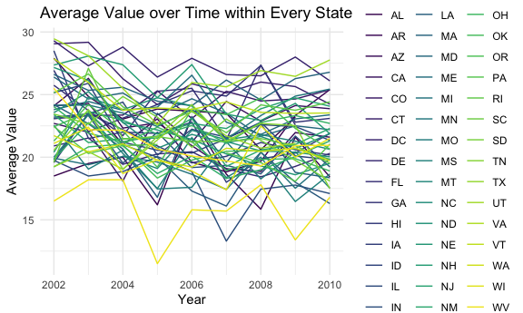

Homework 3
================

``` r
library(tidyverse)
```

    ## ── Attaching packages ─────────────────────────────────────── tidyverse 1.3.1 ──

    ## ✓ ggplot2 3.3.5     ✓ purrr   0.3.4
    ## ✓ tibble  3.1.4     ✓ dplyr   1.0.7
    ## ✓ tidyr   1.1.4     ✓ stringr 1.4.0
    ## ✓ readr   2.0.2     ✓ forcats 0.5.1

    ## ── Conflicts ────────────────────────────────────────── tidyverse_conflicts() ──
    ## x dplyr::filter() masks stats::filter()
    ## x dplyr::lag()    masks stats::lag()

``` r
library(viridis)
```

    ## Loading required package: viridisLite

``` r
library(p8105.datasets)
library(dplyr)

knitr::opts_chunk$set(
  fig.width = 6,
  fig.asp = .6,
  out.width = "90%"
)

theme_set(theme_minimal() + theme(legend.position = "bottom"))

options(
  ggplot2.continuous.colour = "viridis",
  ggplot2.continuous.fill = "viridis"
)

scale_colour_discrete = scale_colour_viridis_d
scale_fill_discrete = scale_fill_viridis_d
```

# Problem 1

First, we need to load the `instacart` data.

``` r
data("instacart")
```

The `instacart` data has 15 variables and 1384617 observations. The
variables include order_id, product_id, add_to_cart_order, reordered,
user_id, eval_set, order_number, order_dow, order_hour_of_day,
days_since_prior_order, product_name, aisle_id, department_id, aisle,
department. Among these, eval_set, product_name, aisle, and department
are character variables, and the others are numerical variables. The
product_name variable indicates the name of products (eg. Bulgarian
Yogurt, Organic Celery Hearts), the aisle variable indicates the aisle
which the products belong to (eg. yogurt, fresh vegetables), and the
department represents the department that the corresponding aisle
belongs to (eg. dairy eggs, produce).

### How many aisles are there, and which aisles are the most items ordered from?

``` r
instacart %>% 
  group_by(aisle) %>% 
  summarize(n_obs = n()) %>% 
  arrange(desc(n_obs))
```

    ## # A tibble: 134 × 2
    ##    aisle                          n_obs
    ##    <chr>                          <int>
    ##  1 fresh vegetables              150609
    ##  2 fresh fruits                  150473
    ##  3 packaged vegetables fruits     78493
    ##  4 yogurt                         55240
    ##  5 packaged cheese                41699
    ##  6 water seltzer sparkling water  36617
    ##  7 milk                           32644
    ##  8 chips pretzels                 31269
    ##  9 soy lactosefree                26240
    ## 10 bread                          23635
    ## # … with 124 more rows

There are `134` aisles. The most items ordered form the
`fresh vegetables` aisle, and the number of orders from this aisle is
150609.

### Plotting the number of items ordered in each aisle with more than 10000 items ordered.

``` r
instacart %>% 
  group_by(aisle) %>% 
  summarize(n_obs = n()) %>% 
  mutate(
    aisle = factor(aisle),
    aisle = fct_reorder(aisle, n_obs)
  ) %>%  
  filter(n_obs > 10000) %>% 
  ggplot(aes(x = aisle, y = n_obs)) +
  geom_point() +
  labs(
    title = "The Number of Items Ordered in Each Aisle", 
    x = "Aisles", 
    y = "The number of items ordered"
  ) + 
  theme(axis.text.x = element_text(angle = 50, hjust = 1))
```


The scatter plot shows the number of items order in each aisle, which
these aisles are those has more than 10000 items ordered.

### The three most popular items in “baking ingredients”, “dog food care”, and “packaged vegetables fruits”

``` r
baking = instacart %>% 
  filter(aisle %in% "baking ingredients") %>% 
  group_by(aisle) %>% 
  count(product_name) %>% 
  mutate(rank = min_rank(desc(n))) %>% 
  arrange(desc(n)) %>% 
  filter(rank <= 3) 

dog = instacart %>% 
  filter(aisle %in% "dog food care") %>% 
  group_by(aisle) %>% 
  count(product_name) %>% 
  mutate(rank = min_rank(desc(n))) %>% 
  arrange(desc(n)) %>% 
  filter(rank <= 3) 

veg = instacart %>% 
  filter(aisle %in% "packaged vegetables fruits") %>% 
  group_by(aisle) %>%
  count(product_name) %>% 
  mutate(rank = min_rank(desc(n))) %>% 
  arrange(desc(n)) %>% 
  filter(rank <= 3) 

baking_dog_veg = bind_rows(baking, dog, veg) %>% 
  subset(select = -rank) 

head(baking_dog_veg)%>% 
  knitr::kable()
```

| aisle              | product_name                                  |   n |
|:-------------------|:----------------------------------------------|----:|
| baking ingredients | Light Brown Sugar                             | 499 |
| baking ingredients | Pure Baking Soda                              | 387 |
| baking ingredients | Cane Sugar                                    | 336 |
| dog food care      | Snack Sticks Chicken & Rice Recipe Dog Treats |  30 |
| dog food care      | Organix Chicken & Brown Rice Recipe           |  28 |
| dog food care      | Small Dog Biscuits                            |  26 |

The table shows that for `baking ingredients`, the top three popular
items are `light brown sugar`, `pure baking soda`, and `cane sugar`, and
the corresponding times of order are 499, 387, and 336; for
`dog food care` aisle, the top three popular items are
`Snack Sticks Chicken & Rice Recipe Dog Treats`,
`Organix Chicken & Brown Rice Recipe`, and `Small Dog Biscuits`, and the
corresponding times of order are 30, 28, and 26; for
`packaged vegetables fruits` aisle, the top three popular items are
`organic baby spinach`, `organic raspberries`, and
`organic blueberries`, and their corresponding times of order are 9784,
5546, and 4966.

### The mean hour at which Pink Lady Apples and Coffee Ice Cream are ordered on each day of the week

``` r
mean_hours = 
  instacart %>% 
  filter(product_name %in% c("Pink Lady Apples", "Coffee Ice Cream")) %>% 
  group_by(product_name, order_dow) %>% 
  summarize(mean_order_hour = mean(order_hour_of_day)) %>% 
  mutate(order_dow = recode(order_dow, `0` = "Sunday", `1` = "Monday", `2` = "Tuesday", `3` = "Wednesday", `4` = "Thurday", `5` = "Friday", `6` = "Saturday")) %>% 
  pivot_wider(
    names_from = order_dow,
    values_from = mean_order_hour
  ) 

head(mean_hours)%>% 
  knitr::kable()
```

| product_name     |   Sunday |   Monday |  Tuesday | Wednesday |  Thurday |   Friday | Saturday |
|:-----------------|---------:|---------:|---------:|----------:|---------:|---------:|---------:|
| Coffee Ice Cream | 13.77419 | 14.31579 | 15.38095 |  15.31818 | 15.21739 | 12.26316 | 13.83333 |
| Pink Lady Apples | 13.44118 | 11.36000 | 11.70213 |  14.25000 | 11.55172 | 12.78431 | 11.93750 |

The table shows that on Sundays, the mean hour of ordering is 13.44118
for pink lady apples and 13.77419 for coffee ice cream; on Mondays, the
mean hour is 11.36000 for apples and 14.31579 for ice cream; on
Tuesdays, the mean hours are 11.70213 and 15.38095 correspondingly; on
Wednesdays, the mean hours are 14.25000 and 15.31818 correspondingly; on
Thursdays, the mean hours are 11.55172 and 15.21739 correspondingly; on
Fridays, the mean hours are 12.78431 and 12.26316 correspondingly; on
Saturdays, the mean hours are 11.93750 and 13.83333 correspondingly.

# Problem 2

``` r
data("brfss_smart2010")
```

##Cleaning the data

``` r
brfss = 
  brfss_smart2010 %>% 
  janitor::clean_names() %>% 
  filter(topic == "Overall Health", response %in% c("Excellent","Very good","Good","Fair","Poor")) %>% 
  mutate(
    response = ordered(response, levels = c("Poor", "Fair", "Good", "Very good", "Excellent"))
  )
```

### In 2002, which states were observed at 7 or more locations? What about in 2010?

``` r
location_2002 = 
  brfss %>% 
  filter(year == "2002") %>% 
  group_by(locationabbr, locationdesc) %>% 
  summarize(n = n()) %>% 
  count(locationabbr) %>% 
  filter(n >= 7)

location_2010 = 
  brfss %>% 
  filter(year == "2010") %>% 
  group_by(locationabbr, locationdesc) %>% 
  summarize(n = n()) %>% 
  count(locationabbr) %>% 
  filter(n >= 7)
```

In 2002, CT, FL, MA, NC, NJ, PA were observed at 7 or more locations; in
2010, CA, CO, FL, MA, MD, NC, NE, NJ, NY, OH, PA, SC, TX, WA were
observed at 7 or more location.

### Construct a dataset that is limited to Excellent responses and make a “spaghetti” plot

``` r
excellent = 
  brfss %>% 
  filter(response %in% "Excellent") %>% 
  group_by(year, locationabbr) %>% 
  summarize(average_value = mean(data_value))
```

``` r
excellent %>% 
  ggplot(aes(x = year, y = average_value, color = locationabbr)) +
  geom_line(aes(group = locationabbr)) +
  theme(legend.position = "right") + 
  labs(
    title = "Average Value over Time within Every State", 
    x = "Year", 
    y = "Average Value",
    color = "States"
  )
```

    ## Warning: Removed 3 row(s) containing missing values (geom_path).



The `excellent` table shows a dataset that is limited to Excellent
responses, and contains, year, state, and a variable that averages the
data_value across locations within a state.

The spaghetti plot shows the average value over time within every state.

### Distribution of data_value for responses among locations in NY State for 2006 and 2010

``` r
ny_state = 
  brfss %>% 
  filter(locationabbr == "NY", year %in% c("2006", "2010")) 

ny_state %>% 
  ggplot(aes(x = response, y = data_value, fill = response)) +
  geom_boxplot(alpha = .5) +
  facet_grid(. ~ year) +
  labs(
    x = "Response",
    y = "Data value", 
    title = "Distribution of Data Value for Responses Among Locations in NY"
  ) +
  theme_bw()
```


The two-panel boxplot shows the distribution of data_value for responses
among locations in NY State for 2006 and for 2010.

# Problem 3

## Clean the dataset

``` r
accel = 
  read_csv("./data/accel_data.csv") %>% 
  janitor::clean_names() %>% 
  mutate(
    weekday_vs_weekend = ifelse(day %in% c("Monday","Tuesday","Wednesday","Thursday","Friday"), "weekday", "weekend")
  ) %>% 
  select(week, day_id, day, weekday_vs_weekend, everything())
```

    ## Rows: 35 Columns: 1443

    ## ── Column specification ────────────────────────────────────────────────────────
    ## Delimiter: ","
    ## chr    (1): day
    ## dbl (1442): week, day_id, activity.1, activity.2, activity.3, activity.4, ac...

    ## 
    ## ℹ Use `spec()` to retrieve the full column specification for this data.
    ## ℹ Specify the column types or set `show_col_types = FALSE` to quiet this message.

The resulting dataset has 1444 variables, which includes week, day_id,
day of the week, weekday vs weekend, and 1440 activity counts for each
minute of a 24-hour day starting at midnight. It has 35 days of
observations.

## Create a table showing total activity variables for each day

``` r
total_activity = 
  accel %>% 
  pivot_longer(
    activity_1:activity_1440,
    names_to = "minute",
    names_prefix = "activity_",
    values_to = "activity"
  ) %>% 
  group_by(day_id, weekday_vs_weekend) %>% 
  summarize(total_actvity = sum(activity))

head(total_activity) %>% 
  knitr::kable()
```

| day_id | weekday_vs_weekend | total_actvity |
|-------:|:-------------------|--------------:|
|      1 | weekday            |     480542.62 |
|      2 | weekday            |      78828.07 |
|      3 | weekend            |     376254.00 |
|      4 | weekend            |     631105.00 |
|      5 | weekday            |     355923.64 |
|      6 | weekday            |     307094.24 |

The table shows the total activity variable for each day. The activities
detected on weekends tend to be less than the weekdays, however, there
also are a few weekend days with high activity level.

## Graph of 24-hour activity time courses for each day

``` r
accel %>% 
  pivot_longer(
    activity_1:activity_1440, 
    names_to = "minute", 
    names_prefix = "activity_", 
    values_to = "activity"
  ) %>% 
  mutate(minute = as.numeric(minute)) %>%
  ggplot(aes(x = minute, y = activity)) +
  geom_point(aes(color = day, alpha = .1)) +
  scale_x_continuous(
    breaks = c(seq(from = 0, to = 1440, by = 120)),
    labels = c((seq(from = 0, to = 1440, by = 120)))
    ) +
  labs(
    x = "Minutes in a day", 
    y = "Activity", 
    title = "24-hour Activity Time Courses for Each Day"
  )
```


According to this graph, the activity tends to be high during the
morning (6 am \~ 12 pm) and the evening (10 pm \~ 11 pm).
